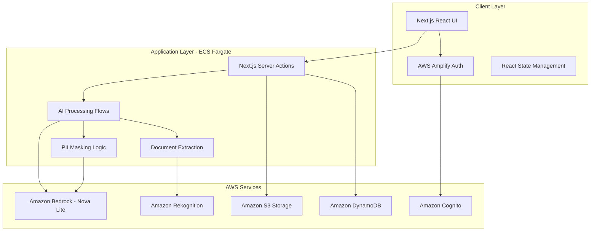
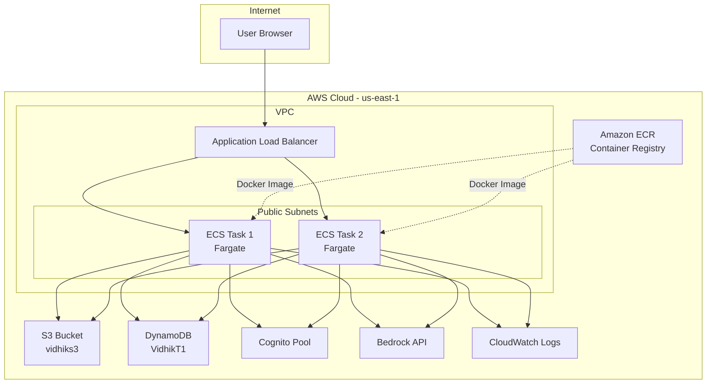

# Design Document: VidhikAI Legal Document Analysis Platform

## Overview

VidhikAI is a privacy-centric web application that empowers users to understand legal documents through AI-powered analysis, comparison tools, and conversational interfaces. The system is built on a modern Next.js 15 frontend with AWS backend services, utilizing Amazon Bedrock (Nova Lite model) for document processing while maintaining strict privacy standards through PII masking and secure data handling.

The platform follows a serverless architecture deployed on AWS ECS Fargate with clear separation between presentation, business logic, and data persistence layers. All AI processing is performed on masked data to ensure user privacy, while the conversational interface provides document-grounded responses to help users understand complex legal language.

## Architecture

### System Architecture



### Deployment Architecture



### Component Architecture

The system is organized into distinct layers:

**Presentation Layer (Next.js React)**
- Dashboard and navigation components
- Document upload and gallery interfaces
- Multi-tab analysis report viewer
- Conversational chat interface
- Authentication and user management UI
- Responsive design with Tailwind CSS and Radix UI

**Application Layer (Next.js Server Actions)**
- Document processing orchestration
- AI analysis coordination via Bedrock
- Privacy and security enforcement
- Session and state management
- RESTful API endpoints

**Document Processing Layer**
- PDF parsing using pdfjs-dist (local)
- DOCX parsing using mammoth library
- Image text extraction via Rekognition
- Text file direct reading from S3
- PII detection and masking

**AI Processing Layer (Amazon Bedrock)**
- Document analysis and summarization using Nova Lite
- Legal jargon explanation
- Risk assessment and obligation extraction
- Document comparison and change detection
- Conversational Q&A with document grounding (RAG)

**Data Persistence Layer (AWS)**
- User authentication via Cognito
- Document storage in S3 with presigned URLs
- Metadata and history in DynamoDB
- Analysis results cached in S3 as JSON
- CloudWatch for logging and monitoring

## Components and Interfaces

### Core Components

#### Document Processor
**Purpose:** Handles document upload, validation, and preprocessing
**Interfaces:**
- `uploadDocument(file: File, userId: string): Promise<DocumentMetadata>`
- `validateDocument(file: File): ValidationResult`
- `extractText(file: File): Promise<string>`
- `detectDocumentType(content: string): DocumentType`

**Key Responsibilities:**
- File format validation and size checking
- OCR processing for image-based documents
- Text extraction and normalization
- Document type classification

#### PII Masking Service
**Purpose:** Identifies and masks personally identifiable information
**Interfaces:**
- `maskPII(content: string): MaskedContent`
- `detectPII(content: string): PIIDetection[]`
- `unmaskForDisplay(maskedContent: MaskedContent): string`

**Key Responsibilities:**
- Pattern-based PII detection (emails, phones, addresses, names)
- Context-aware masking strategies
- Reversible masking for user display
- Privacy compliance enforcement

#### Document Analyzer
**Purpose:** Generates comprehensive analysis reports using AI
**Interfaces:**
- `analyzeDocument(maskedContent: string): Promise<AnalysisReport>`
- `generateSummary(content: string): Promise<string>`
- `extractObligations(content: string): Promise<Obligation[]>`
- `assessRisks(content: string): Promise<RiskAssessment[]>`
- `createGlossary(content: string): Promise<GlossaryEntry[]>`

**Key Responsibilities:**
- AI-powered document summarization
- Legal term explanation and glossary creation
- Risk level assessment (High/Medium/Low)
- Deadline and obligation extraction
- Structured report generation

#### Comparison Engine
**Purpose:** Identifies and explains differences between document versions
**Interfaces:**
- `compareDocuments(doc1: string, doc2: string): Promise<ComparisonResult>`
- `identifyChanges(original: string, modified: string): ChangeSet[]`
- `explainImpact(changes: ChangeSet[]): ImpactExplanation[]`

**Key Responsibilities:**
- Text-based difference detection
- Semantic change analysis
- Impact assessment for modifications
- User-friendly change explanations

#### Chat Interface
**Purpose:** Provides conversational Q&A grounded in document context
**Interfaces:**
- `processQuery(question: string, documentContext: string): Promise<ChatResponse>`
- `generateSuggestions(documentContent: string): string[]`
- `transcribeVoice(audioData: Blob): Promise<string>`
- `validateGrounding(response: string, context: string): boolean`

**Key Responsibilities:**
- Document-grounded response generation
- Voice input transcription and processing
- Contextual question suggestions
- Response validation and grounding verification

#### User Session Manager
**Purpose:** Handles authentication, sessions, and user data management
**Interfaces:**
- `authenticateUser(email: string, password: string): Promise<UserSession>`
- `createSession(userId: string): Promise<SessionToken>`
- `storeUserData(userId: string, data: UserData): Promise<void>`
- `retrieveUserHistory(userId: string): Promise<UserHistory>`

**Key Responsibilities:**
- Firebase authentication integration
- Session token management
- User data persistence and retrieval
- Document deduplication and organization

#### Document Gallery
**Purpose:** Manages user's document collection and history
**Interfaces:**
- `getUserDocuments(userId: string): Promise<DocumentMetadata[]>`
- `searchDocuments(userId: string, query: string): Promise<DocumentMetadata[]>`
- `getDocumentHistory(documentId: string): Promise<DocumentHistory>`
- `deleteDocument(documentId: string, userId: string): Promise<void>`

**Key Responsibilities:**
- Document metadata management
- Search and filtering capabilities
- Access control and permissions
- History tracking and retrieval

## Data Models

### Core Data Structures

```typescript
interface DocumentMetadata {
  id: string;
  userId: string;
  filename: string;
  uploadDate: Date;
  fileSize: number;
  documentType: DocumentType;
  processingStatus: ProcessingStatus;
  analysisId?: string;
}

interface AnalysisReport {
  id: string;
  documentId: string;
  summary: string;
  glossary: GlossaryEntry[];
  risks: RiskAssessment[];
  obligations: Obligation[];
  generatedAt: Date;
}

interface GlossaryEntry {
  term: string;
  definition: string;
  context: string;
}

interface RiskAssessment {
  description: string;
  level: 'High' | 'Medium' | 'Low';
  category: string;
  recommendation: string;
}

interface Obligation {
  description: string;
  deadline?: Date;
  party: string;
  priority: 'Critical' | 'Important' | 'Standard';
}

interface ComparisonResult {
  documentId1: string;
  documentId2: string;
  changes: ChangeSet[];
  impactAnalysis: ImpactExplanation[];
  comparedAt: Date;
}

interface ChangeSet {
  type: 'added' | 'modified' | 'deleted';
  section: string;
  oldContent?: string;
  newContent?: string;
  significance: 'Major' | 'Minor' | 'Cosmetic';
}

interface ChatSession {
  id: string;
  userId: string;
  documentId: string;
  messages: ChatMessage[];
  createdAt: Date;
  lastActivity: Date;
}

interface ChatMessage {
  id: string;
  role: 'user' | 'assistant';
  content: string;
  timestamp: Date;
  voiceInput?: boolean;
}

interface UserSession {
  userId: string;
  email: string;
  sessionToken: string;
  createdAt: Date;
  expiresAt: Date;
}

interface MaskedContent {
  maskedText: string;
  maskingMap: PIIMask[];
  originalLength: number;
}

interface PIIMask {
  type: PIIType;
  startIndex: number;
  endIndex: number;
  placeholder: string;
  originalValue?: string; // Only stored if needed for display
}
```

### Database Schema (Firestore)

**Collections Structure:**
- `users/{userId}` - User profile and preferences
- `documents/{documentId}` - Document metadata and content
- `analyses/{analysisId}` - Analysis reports and results
- `chatSessions/{sessionId}` - Conversational history
- `comparisons/{comparisonId}` - Document comparison results

**Security Rules:**
- Users can only access their own documents and data
- All operations require authenticated user context
- Document sharing requires explicit permission grants
- PII-masked content only in analysis storage

## Correctness Properties

*A property is a characteristic or behavior that should hold true across all valid executions of a system—essentially, a formal statement about what the system should do. Properties serve as the bridge between human-readable specifications and machine-verifiable correctness guarantees.*

Based on the requirements analysis, the following properties ensure system correctness:

### Document Processing Properties

**Property 1: Document Format Processing**
*For any* valid document file (text-based or image-based), the system should successfully process it using the appropriate method (direct processing for text, OCR for images) and produce analyzable content.
**Validates: Requirements 1.1, 1.2**

**Property 2: File Validation and Error Handling**
*For any* invalid or oversized file upload, the system should reject it with clear error messages and format suggestions, maintaining system stability.
**Validates: Requirements 1.3, 1.5**

**Property 3: Document Storage Consistency**
*For any* successfully uploaded document, it should appear in the user's Document Gallery with correct metadata and remain accessible for future analysis.
**Validates: Requirements 1.4, 5.3, 6.1**

### Privacy and Security Properties

**Property 4: PII Masking Before Processing**
*For any* document containing personally identifiable information, all PII should be identified and masked before any AI analysis occurs, ensuring privacy protection.
**Validates: Requirements 2.5, 7.1**

**Property 5: Access Control Enforcement**
*For any* user attempting to access documents or data, the system should only allow access to their own authenticated content, preventing unauthorized data access.
**Validates: Requirements 5.5, 6.5, 7.3**

**Property 6: Secure Data Handling**
*For any* stored user data, it should be encrypted and handled through secure channels, with proper authentication token management.
**Validates: Requirements 7.2, 7.3**

### Analysis and AI Properties

**Property 7: Analysis Report Structure**
*For any* analyzed document, the generated report should contain all required sections (markdown summary, glossary for legal terms, risk assessments with proper categorization, and extracted obligations with dates) in the correct format.
**Validates: Requirements 2.1, 2.2, 2.3, 2.4**

**Property 8: Document Comparison Completeness**
*For any* two document versions being compared, the system should identify and categorize all differences (additions, modifications, deletions) with impact explanations and generate a comprehensive comparison report.
**Validates: Requirements 3.1, 3.2, 3.3, 3.4, 3.5**

**Property 9: Chat Response Grounding**
*For any* user question in the chat interface, responses should be grounded only in the uploaded document content, with clear indication when questions cannot be answered from available context.
**Validates: Requirements 4.1, 4.5**

**Property 10: Chat Interface Consistency**
*For any* chat interaction, the system should provide English-only responses, accurate voice transcription when used, and relevant question suggestions based on document content.
**Validates: Requirements 4.2, 4.3, 4.4**

### Session and Data Management Properties

**Property 11: Session Persistence and Deduplication**
*For any* user login session, it should persist across browser sessions, and any duplicate document uploads should be detected and prevented from redundant storage.
**Validates: Requirements 5.2, 5.4**

**Property 12: Document History and Caching**
*For any* previously analyzed document, accessing it should load stored analysis results and chat history without re-processing, maintaining complete historical context.
**Validates: Requirements 6.2, 6.4**

**Property 13: Search and Filter Functionality**
*For any* search query in the Document Gallery, results should include only relevant documents from the user's collection with proper filtering capabilities.
**Validates: Requirements 6.3**

### Export and UI Properties

**Property 14: Export Format and Privacy**
*For any* content export request, the system should generate files in the requested format (PDF, Word) while maintaining PII masking, proper formatting, timestamps, and complete metadata.
**Validates: Requirements 8.1, 8.2, 8.3, 8.4**

**Property 15: Selective Export Capability**
*For any* export request, users should be able to select specific sections rather than being required to export entire documents.
**Validates: Requirements 8.5**

**Property 16: Multi-tab Interface Behavior**
*For any* analysis result display, content should be organized into distinct tabs (Summary, Glossary, Risks, Obligations) with proper visual indicators for risk levels, deadline highlighting, context preservation during navigation, and efficient loading without page refreshes.
**Validates: Requirements 9.1, 9.2, 9.3, 9.4, 9.5**

**Property 17: Error Handling and Graceful Degradation**
*For any* service interruption or error condition, the system should handle failures gracefully with appropriate error messages and maintain system stability.
**Validates: Requirements 10.5**

**Property 18: Secure Deletion**
*For any* document deletion request, the system should completely remove all associated data (document content, analysis results, chat history) with no recoverable traces.
**Validates: Requirements 7.4**

## Error Handling

The system implements comprehensive error handling across all layers:

**Frontend Error Handling:**
- Network connectivity issues with retry mechanisms
- File upload failures with clear user feedback
- Authentication errors with appropriate redirects
- UI state errors with graceful recovery

**Backend Error Handling:**
- AI service timeouts with fallback responses
- Database connection failures with retry logic
- File processing errors with detailed logging
- Authentication token expiration with refresh mechanisms

**AI Processing Error Handling:**
- Document parsing failures with alternative processing
- PII detection errors with conservative masking
- Analysis generation failures with partial results
- Comparison engine errors with fallback algorithms

**Data Layer Error Handling:**
- Firestore write failures with retry mechanisms
- Storage quota exceeded with user notifications
- Concurrent access conflicts with proper locking
- Data corruption detection with integrity checks

## Testing Strategy

The VidhikAI platform requires a comprehensive testing approach combining unit tests for specific functionality and property-based tests for universal correctness guarantees.

### Unit Testing Approach

Unit tests focus on specific examples, edge cases, and integration points:

**Component-Level Testing:**
- Document upload validation with various file types
- PII masking accuracy with known test cases
- Authentication flow with mock Firebase services
- UI component rendering with different data states

**Integration Testing:**
- End-to-end document processing workflows
- AI service integration with mock responses
- Database operations with test Firestore instances
- Export functionality with file generation verification

**Edge Case Testing:**
- Empty document handling
- Malformed file processing
- Network interruption scenarios
- Concurrent user session management

### Property-Based Testing Configuration

Property tests verify universal properties across randomized inputs using **fast-check** for JavaScript/TypeScript:

**Test Configuration:**
- Minimum 100 iterations per property test
- Custom generators for legal document content
- Randomized user scenarios and file types
- Comprehensive input space coverage

**Property Test Implementation:**
Each correctness property must be implemented as a single property-based test with proper tagging:

```typescript
// Example property test structure
test('Property 4: PII Masking Before Processing', () => {
  fc.assert(fc.property(
    documentWithPIIGenerator(),
    (document) => {
      const maskedContent = piiMasker.maskPII(document.content);
      const analysisInput = documentAnalyzer.prepareForAnalysis(maskedContent);
      
      // Verify no PII remains in analysis input
      expect(containsPII(analysisInput)).toBe(false);
    }
  ), { numRuns: 100 });
});
```

**Test Tags:**
Each property test must include a comment referencing its design property:
```typescript
// Feature: vidhik-ai, Property 4: PII Masking Before Processing
```

### Testing Balance

The testing strategy maintains balance between unit and property tests:

- **Unit tests** handle specific examples, error conditions, and integration verification
- **Property tests** ensure universal correctness across all possible inputs
- **Integration tests** verify component interactions and end-to-end workflows
- **Performance tests** validate system behavior under load (separate from unit/property testing)

This dual approach ensures both concrete bug detection through unit tests and comprehensive correctness verification through property-based testing, providing confidence in system reliability and user privacy protection.
